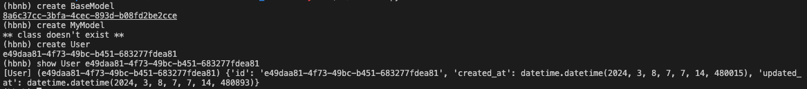
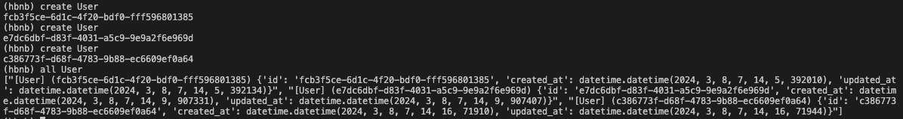
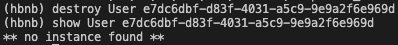
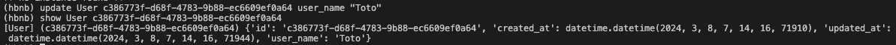

# holbertonschool-AirBnB_clone-The Console

## General

## Description
This project involves building a command-line interface for managing AirBnB objects, serving as the foundation for a full AirBnB clone web application. The command interpreter allows for creating, retrieving, updating, and deleting AirBnB objects such as users and places. It also includes implementing a parent class for object management, defining classes for AirBnB entities, and creating a storage engine for data persistence. Comprehensive unit tests ensure the functionality of the system.

## Requirement

### Python Scripts
* The first line of all files should be exactly #!/usr/bin/python3
* All modules should have a documentation (python3 -c 'print(__import__("my_module").__doc__)')
* All classes should have a documentation (python3 -c 'print(__import__("my_module").MyClass.__doc__)')
* All functions (inside and outside a class) should have a documentation (python3 -c 'print(__import__("my_module").my_function.__doc__)' and python3 -c 'print(__import__("my_module").MyClass.my_function.__doc__)')
* A documentation is not a simple word, it’s a real sentence explaining what’s the purpose of the module, class or method (the length of it will be verified)

### Python Unit Tests
* All test files should be python files (extension: .py)
* All test files and folders should start by test_
* File organization in the tests folder should be the same as your project
    e.g., For models/base_model.py, unit tests must be in: tests/test_models/test_base_model.py
    e.g., For models/user.py, unit tests must be in: tests/test_models/test_user.py
* All tests should be executed by using this command: python3 -m unittest discover tests
* Can also test file by file by using this command: python3 -m unittest tests/test_models/test_base_model.py
* All modules should have a documentation (python3 -c 'print(__import__("my_module").__doc__)')
* All classes should have a documentation (python3 -c 'print(__import__("my_module").MyClass.__doc__)')
* All functions (inside and outside a class) should have a documentation (python3 -c 'print(__import__("my_module").my_function.__doc__)' and python3 -c 'print(__import__("my_module").MyClass.my_function.__doc__)')

## Usage

### Run in interactive mode:
'''bash
./console.py
'''

### Run in non-interactive mode:
'''bash
echo "help" | ./console.py
'''

## Result at the console
* prompt (hbnb) 
* Create and show BaseModel:

* Create and all User:

* Destroy user and show:

  

* Update user and show:

